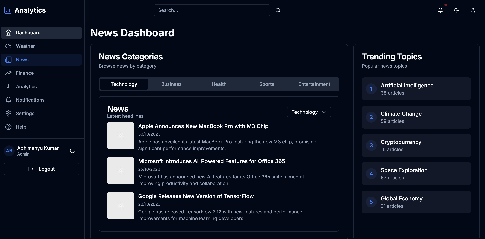
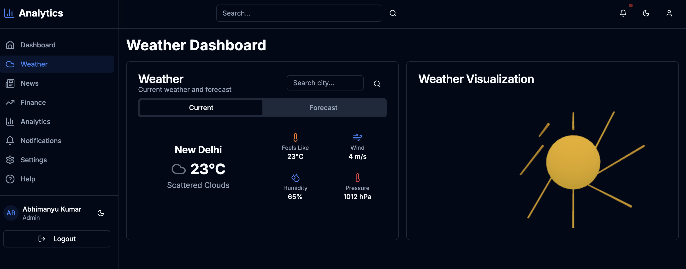
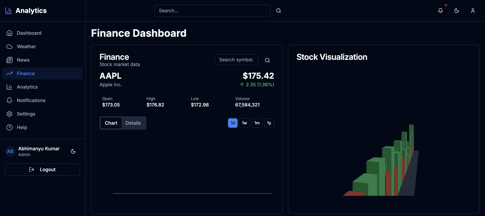

# PGAGI Analytics Dashboard

A high-performance, responsive analytics dashboard built with **Next.js**, **TypeScript**, **Tailwind CSS**, **SCSS**, and powerful data visualization libraries. This dashboard integrates real-time data from Weather, News, and Finance APIs along with advanced animations, state management, and accessibility support.

---

## 🚀 Project Overview

The PGAGI Analytics Dashboard offers an interactive experience combining weather forecasts, financial stock charts, and news headlines—all fetched in real-time from external APIs. It features a modular architecture, drag-and-drop widgets, dark/light mode, real-time updates, localization, and responsive design.

---

## 🛠️ Technologies Used

- **Framework**: Next.js, React
- **Language**: TypeScript
- **Styling**: Tailwind CSS, SCSS Modules, CSS Modules
- **State Management**: Redux Toolkit, RTK Query, Redux Persist
- **Animations**: Framer Motion, Lottie, 3.js
- **Data Viz**: Chart.js, Recharts, Victory, D3.js
- **Authentication**: NextAuth.js (OAuth, Email/Password)
- **Testing**: Jest, React Testing Library, Cypress
- **Localization**: react-i18next
- **CI/CD & Deployment**: GitHub Actions, Vercel/Netlify

---

## 📦 Folder Structure

```
├── components/      # Reusable UI components
├── hooks/           # Custom hooks
├── pages/           # Next.js pages
├── public/          # Static assets
├── services/        # API integrations
├── store/           # Redux Toolkit setup
├── styles/          # SCSS, Tailwind configs
├── utils/           # Helper functions
├── tests/           # Unit & integration tests
└── .env             # Environment variables
```

---

## 📥 Installation Instructions

1. **Clone the repository:**
   ```bash
   git clone https://github.com/your-username/pgagi-analytics-dashboard.git
   cd pgagi-analytics-dashboard
   ```

2. **Install dependencies:**
   ```bash
   npm install
   ```

3. **Create a `.env.local` file:**
   ```env
   NEXT_PUBLIC_OPENWEATHER_API_KEY=your_openweather_key
   NEXT_PUBLIC_NEWS_API_KEY=your_newsapi_key
   NEXT_PUBLIC_ALPHA_VANTAGE_API_KEY=your_alpha_vantage_key
   NEXTAUTH_URL=http://localhost:3000
   NEXTAUTH_SECRET=your_secret
   ```

---

## ▶️ How to Run the Project

- **Start the development server:**
  ```bash
  npm run dev
  ```

- **Build for production:**
  ```bash
  npm run build
  npm start
  ```

---

## 🧪 Testing Instructions

- **Run unit & integration tests:**
  ```bash
  npm run test
  ```

- **View test coverage:**
  ```bash
  npm run test:coverage
  ```

- **Run end-to-end tests (Cypress):**
  ```bash
  npx cypress open
  ```

---

## 🔐 Authentication

- Built with **NextAuth.js**
- Supports **Google, GitHub**, and **email/password**
- Protects dashboard routes from unauthorized access

---

## 🌐 Localization

- Switch between **English** and **Spanish**
- Implemented with `react-i18next`

---

## 🌙 Theming

- Toggle between **dark** and **light** themes
- Smooth transitions via Tailwind CSS
- Theme preference is persisted in `localStorage`

---

## 🧠 Features

- 📊 **Weather Data**: 7-day forecast, auto geolocation, interactive charts
- 📰 **News Feed**: Category filters, infinite scroll, detail modals
- 💹 **Finance Dashboard**: Stock symbol search, interactive charts, metrics
- 🧩 **Widget Customization**: Drag-and-drop dashboard layout
- 🔄 **Real-Time Updates**: Using WebSockets/SSE
- 🔔 **Notifications**: In-app alerts for key events
- 📈 **Advanced Animations**: Dynamic charts, animated weather backgrounds
- ⚙️ **Responsive Design**: Optimized for mobile, tablet, and desktop
- ♿ **Accessibility**: ARIA support, full keyboard navigation
- 🚀 **Performance Optimized**: SSR, lazy loading, image optimization
- 🔍 **Search & Filtering**: With debounce, autocomplete, and multi-criteria filters

---

## 🔐 Environment Variables

| Variable                          | Description                         |
|----------------------------------|-------------------------------------|
| `NEXT_PUBLIC_OPENWEATHER_API_KEY`| OpenWeatherMap API key             |
| `NEXT_PUBLIC_NEWS_API_KEY`       | NewsAPI API key                    |
| `NEXT_PUBLIC_ALPHA_VANTAGE_API_KEY`| Alpha Vantage API key           |
| `NEXTAUTH_URL`                   | Auth callback base URL             |
| `NEXTAUTH_SECRET`                | Secret key for JWT                 |

---

## 🔧 API Setup

- Sign up at:
  - [OpenWeatherMap](https://openweathermap.org/api)
  - [NewsAPI](https://newsapi.org/)
  - [Alpha Vantage](https://www.alphavantage.co/)
- Add your API keys to `.env.local`

---

## 🌍 Deployment

- Hosted on **Vercel**
- CI/CD via **GitHub Actions**:
  - Linting
  - Tests
  - Deployment

Live Link: [https://pgagai-assigment.vercel.app/]

---

## 📸 Screenshots

### Weather Dashboard  


### News Feed  


### Finance 



---

## 📚 Additional Notes

- 🎁 Bonus integration: [e.g., GitHub API for Repo stats]
- 🧪 80%+ test coverage achieved
- 🛡️ Security best practices followed (input sanitization, environment configs)
- 📈 Lighthouse score: 90+ across performance, accessibility, best practices

---

## 🤝 Contributing

Pull requests are welcome. For major changes, please open an issue first to discuss what you would like to change.

---

## 📜 License

[MIT](LICENSE)

---

## 📞 Contact

For any questions, reach out to the PGAGI or [Abhimanyu] at [abhiroy829429@gmail.com].
